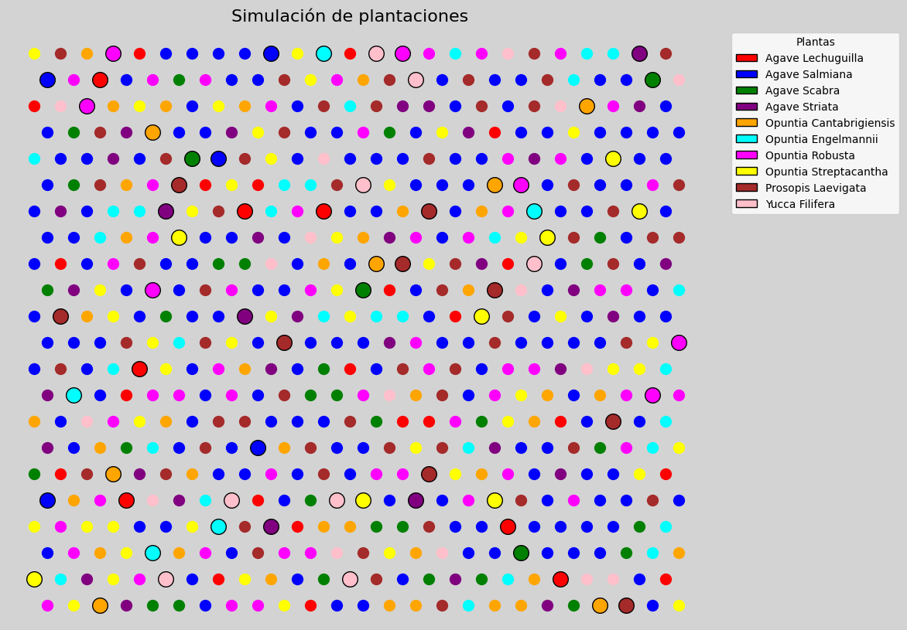

# Reforestation Optimization with Genetic Algorithms

This project implements a **genetic algorithm** to design an optimal planting strategy for reforesting a 1-hectare plot with 625 native plant specimens. The algorithm aims to minimize biological competition between species, ensure species requirements are met, and simulate realistic planting conditions—including preexisting vegetation.

---

## 🌍 Problem Context

As part of an environmental restoration challenge in collaboration with CONAFOR, this project addresses the need to reforest degraded or deforested areas in a sustainable and ecologically beneficial way. Proper species placement is critical to avoid biological competition and ensure long-term survival.

---

## ⚙️ Key Features

- 🌾 **Realistic simulation** of existing plants in the field  
- 🔁 **Genetic algorithm** with selection, crossover, and mutation tailored to a biological compatibility matrix  
- 🌱 **10 native species** with individual planting quotas and known inter-species competition levels  
- 🧠 **Fitness function** that penalizes species over-assignment and rewards biologically optimal neighborhoods  
- 🧪 **Hexagonal grid layout** (threebolillo pattern) for realistic spatial modeling  
- 📊 **Visualization** of the final planting layout using `matplotlib`

---

## 🧮 Objective Function

The algorithm maximizes ecological benefit by minimizing the sum of competition costs across all plant neighbors, while meeting species quotas.

---

## 🧪 Technologies Used

- Python 3.11  
- NumPy, Matplotlib  
- Custom implementation of:
  - Selection (roulette wheel)
  - Crossover with multiple points
  - Mutation with fixed probability  
- Data modeling with graphs and adjacency lists

---

## 🌳 Species Modeled

The following 10 species were considered, each with a specific quota and interaction profile:

| ID  | Species Name               |
|-----|----------------------------|
| 1   | Agave Lechuguilla          |
| 2   | Agave Salmiana             |
| 3   | Agave Scabra               |
| 4   | Agave Striata              |
| 5   | Opuntia Cantabrigiensis    |
| 6   | Opuntia Engelmannii        |
| 7   | Opuntia Robusta            |
| 8   | Opuntia Streptacantha      |
| 9   | Prosopis Laevigata         |
| 10  | Yucca Filifera             |

Each species interacts differently with others, and their compatibility is encoded in a 10×10 matrix.

---

## 📈 Results

- **Fitness achieved:** ~0.66  
- **Execution time:** ~X seconds (varies by machine)  
- **Total initial plants:** ~65  
- **Visual output:** Color-coded map of species distribution

---

## 🤝 Contributors

This project was developed as part of the *Stochastic Optimization Challenge* at Tecnológico de Monterrey, in collaboration with:

- Víctor Adid Salgado Santana  
- José Manuel Guerrero Arellano  
- José Antonio Torres Villegas  
- Ricardo Marín Pérez  
- Daniel Ríos Zúñiga

---

## 🧭 Future Work

- Extend to larger plots with terrain variability  
- Integrate cost modeling for replanting  
- Enable multi-hectare scalability and inventory adjustment

---

🌿 *This tool supports ecological restoration efforts by aligning technology with sustainability.*

